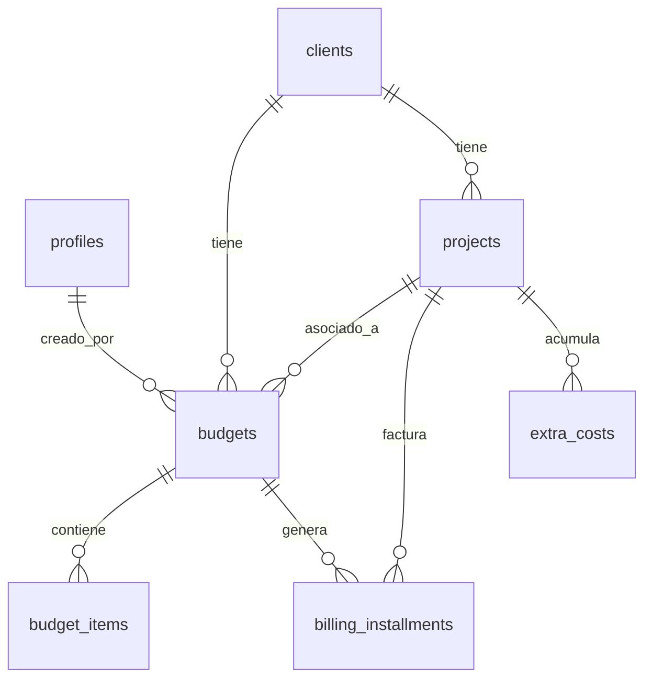

# Guía de Contexto y Criterios de Diseño (AGENTS.md)

Este archivo sirve como referencia principal para cualquier Asistente de IA de programación que trabaje en el codebase del ERP y CRM de **SPOERER**. Úsalo para entender la arquitectura, convenciones, flujos de datos y criterios estéticos.

---

## 1. Objetivo General del Proyecto

**SPOERER ERP Suite** es una plataforma web modular diseñada para la gestión empresarial integrada de la empresa Spoerer. Permite administrar:
* **CRM (Clientes):** Control de clientes, giros, direcciones, RUTs, y la unificación bajo el concepto de **Cliente Real**.
* **Presupuestos:** Creación, edición, control de estados (Borrador, En revisión, Enviado, Aprobado, Rechazado) e ítems unitarios, con almacenamiento de archivos de respaldo en Supabase Storage.
* **Facturación:** Seguimiento detallado de cuotas de cobro programadas (billing installments) y conversión automática entre valores en UF y CLP.
* **Proyectos:** Creación de proyectos a partir de la aprobación de presupuestos, gestión de superficies (m²), rentabilidad, costos adicionales (costos extras) y cronograma de cobro.
* **Control de Accesos (Usuarios):** Administración de perfiles (Admin, Sales, etc.) y estados de cuenta (Active, Inactive).

---

## 2. Arquitectura y Estructura del Código

El proyecto es una aplicación Single Page Application (SPA) construida con **React (v19)** y **Vite**.

```
Spoerer_ERP/
├── .agents/                    # Customizaciones y habilidades para las IAs
│   └── AGENTS.md               # Este archivo de directrices
├── public/                     # Recursos estáticos públicos
├── src/
│   ├── assets/                 # Imágenes y logos corporativos (ej. logo SPR.PNG)
│   ├── components/             # Componentes modulares (uno por pestaña del ERP)
│   │   ├── CRM.jsx             # Vista y modales del módulo de Clientes
│   │   ├── Facturacion.jsx     # Seguimiento y desglose de cuotas
│   │   ├── Login.jsx           # Pantalla de autenticación inicial
│   │   ├── Presupuestos.jsx    # Creación y aprobación de cotizaciones
│   │   ├── Proyectos.jsx       # Gestión de proyectos, costos extras e installments
│   │   ├── Sidebar.jsx         # Layout contenedor y barra lateral de navegación
│   │   └── Usuarios.jsx        # Gestión de accesos para administradores
│   ├── utils/                  # Funciones de utilidad y conexión con APIs
│   │   ├── supabaseClient.js   # Inicialización básica del cliente de Supabase
│   │   ├── supabaseService.js  # Capa de abstracción de base de datos y Storage (CRUDs)
│   │   └── validation.js       # Validaciones de negocio (ej. RUT chileno)
│   ├── App.css                 # Estilos específicos del App wrapper
│   ├── index.css               # Estilos globales y utilidades personalizadas
│   ├── main.jsx                # Punto de entrada de React
│   └── App.jsx                 # Estado global plano y enrutador modular
├── index.html                  # Plantilla HTML con Tailwind CDN y configuración extendida
├── package.json                # Dependencias (React, Supabase SDK, Mammouth, XLSX)
└── vite.config.js              # Configuración del empaquetador Vite
```

---

## 3. Criterios de Diseño y Estética UI

### Framework y Estilos
* **Tailwind CSS via CDN:** Los estilos se aplican mediante clases de Tailwind. El script de configuración extendida está en [index.html](file:///d:/Programacion/Spoerer_ERP/index.html).
* **Paleta de Colores Corporativos:** No utilices colores genéricos (como `bg-blue-500` o `text-red-600` puros). Usa los tokens extendidos configurados en el tema:
  * `primary`: `#091426` (Azul profundo de la marca)
  * `primary-container`: `#1e293b` (Slate oscuro para paneles secundarios)
  * `secondary`: `#006a61` (Esmeralda/Turquesa oscuro)
  * `secondary-container`: `#86f2e4` (Fondo turquesa suave)
  * `secondary-fixed`: `#89f5e7`
  * `background` / `surface`: `#f8f9ff` (Azul/Grisáceo muy claro)
  * `surface-container-low`: `#eff4ff` (Fondo alternativo para tarjetas y modales)
  * `outline-variant`: `#c5c6cd` (Gris claro para bordes finos)
* **Tipografía e Iconos:**
  * **Familia tipográfica:** `Inter` (cargada desde Google Fonts).
  * **Iconos:** `Material Symbols Outlined` (ej. `<span className="material-symbols-outlined">settings</span>`).
* **Efectos e Interactividad:**
  * Tarjetas Premium: Usa la clase `.glass-card` definida en [index.css](file:///d:/Programacion/Spoerer_ERP/src/index.css) para lograr efectos semitransparentes modernos.
  * Transiciones: Usa `.hover-scale` para agrandar levemente componentes al posar el cursor, y `.active-scale` para la respuesta al hacer clic.

---

## 4. Integración y Modelo de Datos (Supabase)

La capa de comunicación con la base de datos se centraliza en [supabaseService.js](file:///d:/Programacion/Spoerer_ERP/src/utils/supabaseService.js). 

### Convenciones de Mapeo
* **Base de Datos (Postgres):** Utiliza nombres de columna en **snake_case** (ej. `company_name`, `planned_amount_uf`).
* **Frontend (React):** Traduce y mapea los datos a **camelCase** (ej. `company`, `uf`) en la salida de las funciones del servicio para consistencia con el código JavaScript.

### Relación de Tablas del Negocio


1. **`clients`:** Información del cliente final. Destaca la columna `real_client` (`realClient`) que sirve para agrupar clientes jurídicos bajo una misma entidad unificada para reportes consolidados.
2. **`budgets`:** Almacena el encabezado de las cotizaciones. Contiene el estado actual y un campo JSONB `backup_files` que contiene las URLs públicas y paths de documentos adjuntos cargados en Supabase Storage.
3. **`budget_items`:** Detalles y filas del presupuesto (descripción, cantidad y precio unitario).
4. **`projects`:** Proyectos creados tras la aprobación de un presupuesto. Congela y hereda el monto final del presupuesto de origen.
5. **`billing_installments`:** Cuotas de facturación programadas. Contienen el monto planificado en UF, estado de cobro, números de facturas, fechas de pago y desglose en CLP neto/IVA/total calculado al momento de facturar.
6. **`extra_costs`:** Costos extras imprevistos asociados a un proyecto que aumentan el costo total y afectan la rentabilidad.

### Lógica de Documentos y Archivos (Storage)
Los presupuestos permiten adjuntar archivos de respaldo.
* Se almacenan en el bucket `budgets` dentro de la carpeta `presupuestos/`.
* Los archivos se organizan dinámicamente en carpetas según el estado del presupuesto: `/borradores`, `/enviados`, `/aprobados`, `/rechazados`.
* **¡Importante!** Al cambiar el estado de un presupuesto, el backend o servicio de Supabase (`moveQuoteFiles`) mueve automáticamente los archivos físicos en el Storage para reflejar la carpeta de estado correspondiente y actualiza sus URLs.

---

## 5. Directrices y Buenas Prácticas para el Desarrollo

1. **Mantener Estado Plano:** El componente principal [App.jsx](file:///d:/Programacion/Spoerer_ERP/src/App.jsx) mantiene e hidrata estados planos de React (`clients`, `quotes`, `projects`, etc.) alineados con las tablas SQL. Al actualizar un registro, hazlo actualizando la referencia en el estado principal para gatillar rerenders limpios en cascada.
2. **Respetar la Capa del Servicio:** Nunca ejecutes `supabase.from(...)` de manera directa en componentes de UI si ya existe una función que encapsule la lógica en [supabaseService.js](file:///d:/Programacion/Spoerer_ERP/src/utils/supabaseService.js). Agrega nuevas funciones al objeto exportado `supabaseService` si la operación es nueva.
3. **Mapeo de Datos Obligatorio:** Al insertar o actualizar datos en Supabase, asegúrate de convertirlos al formato adecuado utilizando los helpers de mapeo (ej. `mapClientToDb` y `mapClientFromDb`).
4. **Validación de Identificaciones:** Cualquier campo que reciba un RUT chileno debe formatearse usando `formatRut()` y validarse usando `validateRut()` de [validation.js](file:///d:/Programacion/Spoerer_ERP/src/utils/validation.js).
5. **Consistencia de Estilos:** Mantén la coherencia en el diseño de las modales y tarjetas:
   * Fondos de modales principales usando `bg-surface` o `bg-surface-container-low`.
   * Bordes redondeados consistentes (`rounded-xl` o `rounded-full` según sea el caso).
   * Evita crear estilos inline extensos; prefiere clases preconfiguradas de Tailwind o variables CSS de [index.css](file:///d:/Programacion/Spoerer_ERP/src/index.css).
6. **Formato de Fechas:** Por definición de negocio, todas las fechas que se presenten al usuario en la interfaz o que se exporten en reportes (como archivos Excel) deben mostrarse en formato `dd/mm/yyyy` (ej. `15/10/2026`). Al capturar fechas de elementos `<input type="date">` (que usan el estándar nativo `yyyy-mm-dd`), realiza la conversión a `dd/mm/yyyy` al guardar o procesar en el frontend.

